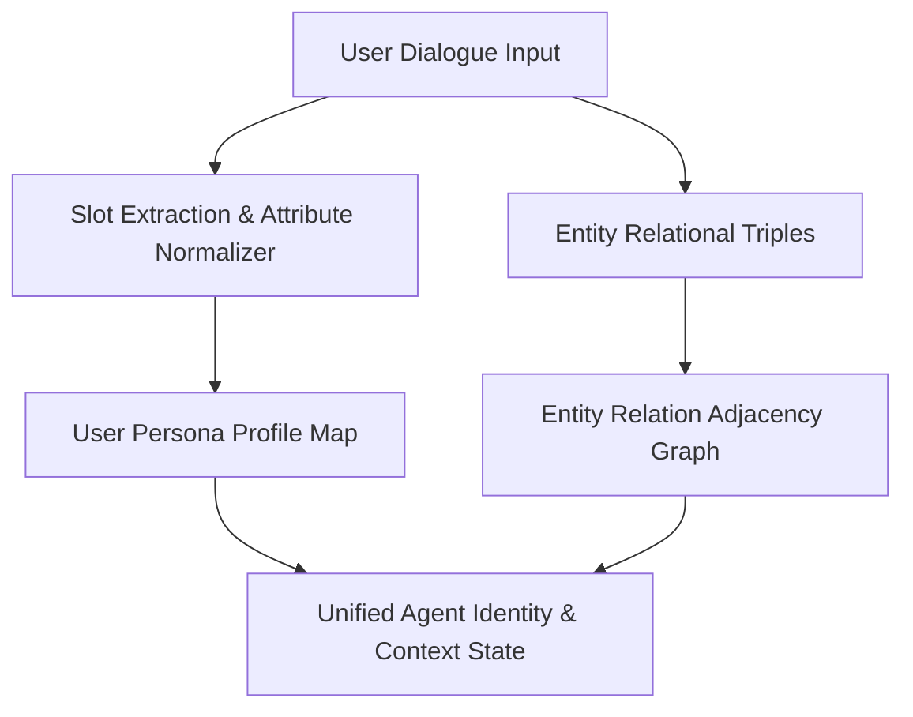

# genpark-agent-persona-entity-state-tracker-skill

Agent Skill implementing **Persistent Persona Profiles & Relational Entity State Tracking** in 100% Python standard library.

## Architectural Flow

